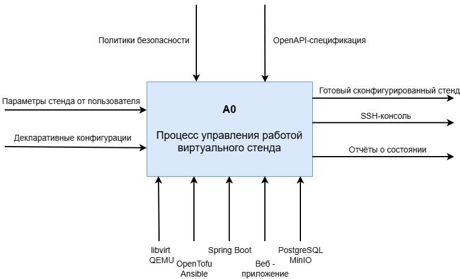
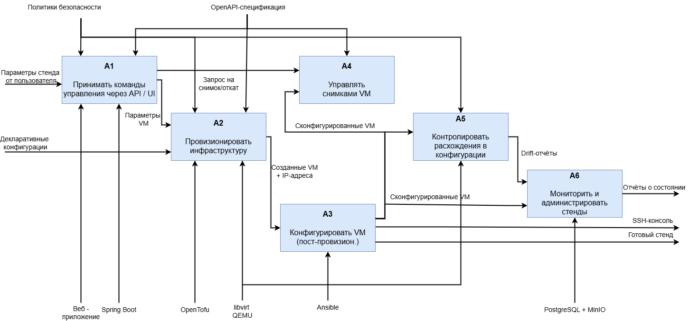
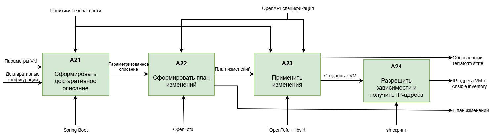
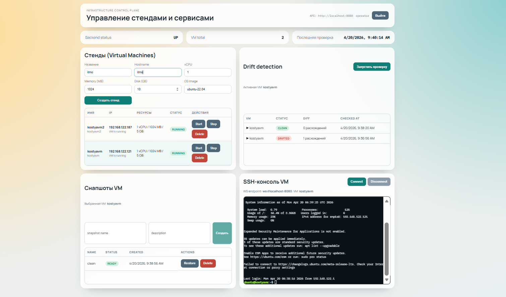
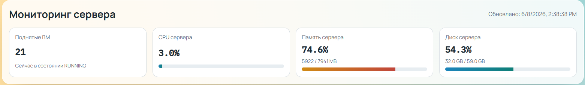
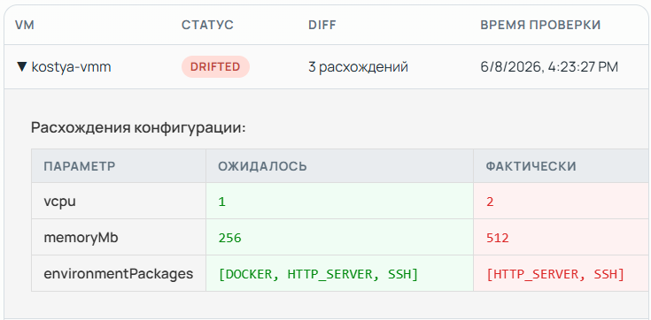

# Infrastructure Control Plane

Веб-система для управления виртуальными машинами в лабораторной инфраструктуре. Проект объединяет React-интерфейс, Spring Boot backend, OpenTofu, Ansible и KVM/libvirt, чтобы оператор мог создавать и обслуживать VM без ручного запуска `virsh`, `tofu` и playbook-ов.

Главная идея системы: пользователь описывает желаемую VM в браузере, backend сохраняет это состояние, OpenTofu создает ресурсы в libvirt, Ansible настраивает гостевую ОС, а UI показывает результат, drift, снапшоты, мониторинг и SSH-доступ.

## Возможности

- Создание VM с выбором имени, hostname, CPU, RAM, диска, ОС и набора окружения.
- Поддержка профилей `ubuntu` и `alpine`.
- Установка опциональных компонентов: `SSH`, `DOCKER`, `HTTP_SERVER`.
- Запуск, остановка и удаление VM из UI.
- Автоматическая генерация OpenTofu desired state и Ansible inventory.
- Проверка configuration drift между ожидаемым состоянием и фактической VM.
- Создание, удаление и восстановление libvirt-снапшотов.
- Мониторинг хоста виртуализации: CPU, память, диск, количество RUNNING VM.
- Встроенный xterm.js терминал с WebSocket-прокси до SSH-сессии VM.

## Архитектура

### A0 контекстная диаграмма



### Декомпозиция A0



### Декомпозиция A2



## Основной сценарий работы

1. Оператор входит в UI и создает VM через форму.
2. Backend создает запись в PostgreSQL со статусом `CREATING`.
3. Сервис provisioning берет инфраструктурный lock, чтобы операции OpenTofu не пересекались.
4. Backend записывает желаемое состояние VM в `tofu/generated/vms.auto.tfvars.json`.
5. OpenTofu применяет состояние на KVM/libvirt-хосте.
6. Backend ожидает IP-адрес VM и генерирует Ansible inventory.
7. Ansible запускает playbook для выбранной ОС и устанавливает выбранное окружение.
8. VM переходит в `RUNNING`, а UI показывает IP, ресурсы и актуальный статус.

Ключевой фрагмент workflow в backend:

```java
infrastructureCommandService.writeDesiredState(allVirtualMachines);
infrastructureCommandService.applyDesiredState();

String ipAddress = infrastructureCommandService.waitForVmIp(virtualMachine.getName());
infrastructureCommandService.writeAnsibleInventory(allVirtualMachines, vmIps);
infrastructureCommandService.runAnsibleForVmWithPlaybook(virtualMachine.getName(), playbookFile);
```

Пример generated state для OpenTofu:

```json
{
  "vms": {
    "demo-vm": {
      "name": "demo-vm",
      "hostname": "demo-vm",
      "vcpu": 1,
      "memory_mb": 1024,
      "disk_size_gb": 10,
      "os_image": "ubuntu_22_04"
    }
  }
}
```

OpenTofu-модуль создает libvirt domain, cloud-init ISO и qcow2-диск от базового образа:

```hcl
resource "libvirt_domain" "vm" {
  name    = var.name
  memory  = var.memory
  vcpu    = var.vcpu
  running = true
}
```

## Что видит пользователь

После входа оператор работает с одной панелью:



- `Мониторинг сервера` показывает состояние хоста виртуализации.
  
- `Виртуальные машины` отвечает за создание VM и операции start/stop/delete.
- `Drift detection` сравнивает ожидаемую и фактическую конфигурацию выбранной VM.
- `Снимки VM` управляют точками восстановления.
- `SSH-консоль VM` открывает интерактивный терминал в браузере.

## Drift и снапшоты

Drift detection строит отчет по VM и сравнивает имя, hostname, vCPU, RAM, диск, ОС, выбранные пакеты и power state. Ожидаемое состояние берется из базы и OpenTofu, фактическое - из libvirt и файла `/etc/diploma-vm-info` внутри гостевой ОС. Результат отображается как `CLEAN` или `DRIFTED` с перечнем различий.



Снапшоты реализованы через libvirt external disk snapshot. Система создает snapshot, хранит запись в PostgreSQL, умеет удалить metadata и восстановить VM из выбранной точки.

## API

Основные endpoints:

- `POST /api/v1/auth/login`, `POST /api/v1/auth/register`
- `GET /api/v1/health`
- `POST /api/v1/vms`, `GET /api/v1/vms`
- `POST /api/v1/vms/{id}/start`, `POST /api/v1/vms/{id}/stop`
- `POST /api/v1/vms/{vmId}/drift`, `GET /api/v1/drift-reports`
- `POST /api/v1/vms/{vmId}/snapshots`
- `POST /api/v1/vms/{vmId}/snapshots/{id}/restore`
- `GET /api/v1/monitoring/overview`

OpenAPI-документация доступна по адресу `/swagger-ui.html`.

## Технологический стек

- Backend: Java 21, Spring Boot 3, Spring Security, Spring Data JPA, WebSocket, JSch.
- Frontend: React 18, TypeScript, Vite, xterm.js.
- Infrastructure: OpenTofu, libvirt provider, KVM/libvirt, cloud-init.
- Configuration management: Ansible.
- Storage: PostgreSQL для данных приложения, MinIO как S3-compatible backend для OpenTofu state.

## Запуск локального стенда

Поднять PostgreSQL и MinIO:

```bash
docker compose up -d
```

Запустить backend:

```bash
cd backend
./gradlew bootRun
```

Запустить frontend:

```bash
cd frontend
npm install
npm run dev
```
